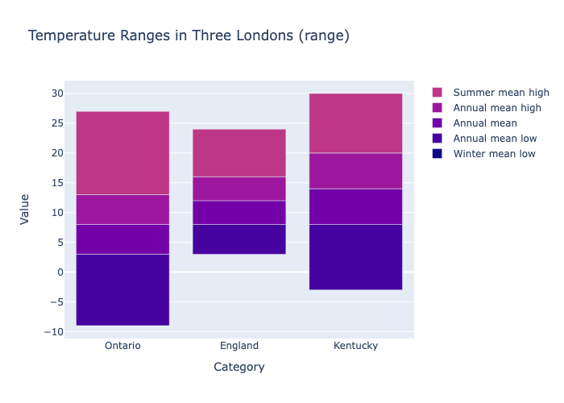

# Range Charts in Plotly.py
MinutePhysics [made a video](https://www.youtube.com/watch?v=5zBg9pH_6bE) about lack of range chart support in Plotly.py -- and while they're not a named chart type, it's certainly possible to build them!



To set up, use `uv`:
```shell
uv init
source .venv/bin/activate
uv sync
```
